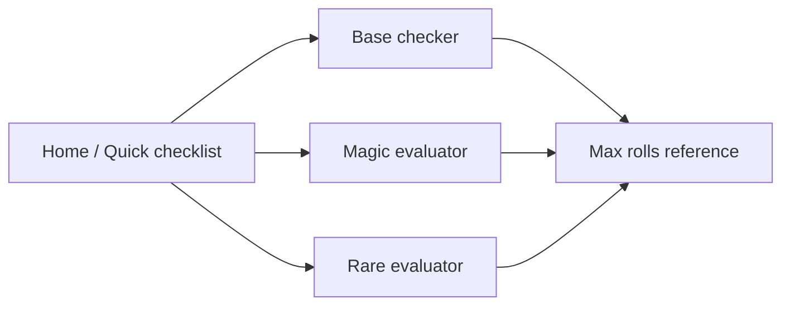

# D2R Item Keeper — Architecture

Fast lookup while playing **Diablo 2: Resurrected**: decide whether a drop is a **base worth keeping**, or a **magic/rare** with valuable affixes. Optimized for a second monitor, tablet, or alt-tab — minimal clicks, large targets, keyboard-friendly.

**Source of truth:** `data/D2R_Items_To_Keep_Season14.md` (copied from your Season 14 list). A build step turns markdown tables into structured JSON for the app.

---

## Goals

| Priority | Requirement |
|----------|-------------|
| P0 | Answer in **&lt; 5 seconds**: keep / maybe / chuck |
| P0 | Three clear modes: **Base**, **Magic**, **Rare** |
| P1 | Show **why** (matched rules + gaps vs max rolls) |
| P1 | **Offline** after first load (PWA) |
| P2 | Easy seasonal updates (re-parse markdown or edit JSON) |

**Out of scope (v1):** rune word builder, trade prices, stash sync, OCR from screenshots, uniques/sets/crafts/charms (doc mentions Sunder Charms in intro but has no charm section — add later).

---

## Recommended stack (implemented)

```
┌─────────────────────────────────────────────────────────┐
│  Tauri 2 desktop overlay — Vite + React + TypeScript    │
│  • Frameless, always-on-top, transparent window         │
│  • Drag title bar • Pin / minimize / close              │
└──────────────────────────┬──────────────────────────────┘
                           │ loads
┌──────────────────────────▼──────────────────────────────┐
│  data/*.json  (bases.json seeded from Season 14 MD)     │
└──────────────────────────▲──────────────────────────────┘
                           │ future: scripts/build_data.py
┌──────────────────────────┴──────────────────────────────┐
│  Python 3.11+ — optional MD → JSON pipeline + tests     │
└─────────────────────────────────────────────────────────┘
```

**Why Tauri:** small native binary, true always-on-top overlay over the game, no browser chrome.

**Browser fallback:** `npm run dev:web` runs the same UI at http://localhost:1420 without overlay features.

---

## Information architecture (UI)

### Shell (always visible)

- **Header:** mode tabs `Base | Magic | Rare` + season badge `S14 / 3.2`
- **Search** (global): jumps to base name or slot; `/` focuses search
- **Verdict bar:** `KEEP` (green) / `CHECK` (amber) / `CHUCK` (gray) + one-line reason

### Mode 1 — Base checker (most common)

**Flow:** type base name → set 3 toggles → instant verdict.

```
[ Search: "archon"     ▼ Archon Plate ]

Eth:  ( ) Norm  ( ) Eth  (•) Either     ← from rule.eth_policy
Soc:  [3] [4] [other: __]                 ← keyboard 3/4/5/6
Sup:  [ ] 10–15% ED  [ ] 15% ED exact

▼ Archon Plate — Body Armor
   BOTH · prefer sockets 3, 4
   Non-ETH 3s Enigma; non-ETH 4s Fortitude; ETH 4s merc Fortitude
   KEEP: superior 10–15% ED + correct sockets
```

**Rules engine (bases):**

1. Resolve base by name (alias table: “archon” → Archon Plate).
2. If `eth_policy` is `NORM` and user picked Eth → **CHUCK** (unless notes say exception).
3. If `sockets_preferred` contains selected count → **KEEP**; if in `sockets_acceptable` → **CHECK**; else **CHUCK**.
4. If `superior_ed_min` set and user marked superior below min → **CHECK**.
5. Special rules (e.g. Monarch: **exactly** 4 sockets, Larzuk note) as `flags: ["larzuk_4", "exact_socket_count"]`.

**Category browser (optional left rail):** Body Armor | Helm | Shield | … for browse-without-typing.

### Mode 2 — Rare evaluator

**Flow:** pick slot → enter/toggle affixes → see score vs “keep if”.

```
Slot: [ Amulet ▼ ]

Core (required for KEEP):
  [x] +2 Class Skills    [x] 10% FCR

Secondaries (tap if present on item):
  Life [40]  Mana [__]  Str [10]  Dex [__]  All Res [10]  Single Res [35]

KEEP — Core met + 2 strong secondaries (life/mana/str/dex/res)
Reference: amulet max FCR 10%, life 40 — you hit FCR max
```

**Rules engine (rares):**

- Each slot has `core` (AND group) and `secondaries` (scored list with `min` thresholds).
- **KEEP:** all `core` satisfied + `min_secondary_count` secondaries at threshold.
- **CHECK:** core satisfied but one secondary short, OR one core stat within 90% of threshold (configurable).
- **CHUCK:** else.
- Side panel: **max roll table** from doc (read-only reference).

Class-specific notes (e.g. Warlock circlet priorities) shown as collapsible hints, not hard gates in v1.

### Mode 3 — Magic evaluator

**Flow:** slot → pick **preset combo** or freeform affixes.

Presets come straight from your doc, e.g.:

- Gloves: `3% LL + 20% IAS` → **KEEP** (BiS note)
- Circlet: `+3 Fire Skills` → **KEEP**
- Shield: `Prismatic 40% all res` on Monarch → **KEEP** (transitional)

**Rules engine (magic):**

- Primary: user selects a **target row** → instant KEEP + explanation.
- Secondary: affix checklist with “known BiS combos” highlighted.
- Flag `crafting_input: true` for “keep any ilvl 90+ amulet” style rules (amulet crafting).

---

## Data model

### `bases.json`

```json
{
  "season": "14",
  "patch": "3.2",
  "bases": [
    {
      "id": "archon_plate",
      "name": "Archon Plate",
      "category": "body_armor",
      "eth_policy": "BOTH",
      "sockets_preferred": [3, 4],
      "sockets_acceptable": [],
      "superior_ed_min": 10,
      "superior_ed_ideal": 15,
      "flags": [],
      "notes": "Non-ETH 3s Enigma; non-ETH 4s Fortitude; ETH 4s merc Fortitude.",
      "keep_summary": "Superior 10–15% ED with correct socket count."
    },
    {
      "id": "monarch",
      "name": "Monarch",
      "category": "shield",
      "eth_policy": "NORM",
      "sockets_preferred": [4],
      "flags": ["exact_socket_count", "larzuk_gives_4"],
      "notes": "Spirit base. Keep all non-ETH Monarchs."
    }
  ],
  "catch_all_rules": [
    {
      "id": "eth_elite_weapon_456",
      "text": "Any ETH 4/5/6-socket elite polearm/spear",
      "category": "weapon_polearm",
      "eth_policy": "ETH",
      "sockets_preferred": [4, 5, 6],
      "match": { "tier": "elite", "eth": true }
    }
  ]
}
```

### `rare_slots.json`

```json
{
  "slots": {
    "amulet": {
      "label": "Rare Amulet",
      "max_rolls": {
        "fcr": 10,
        "life": 40,
        "mana": 40,
        "class_skills": 2,
        "all_res": 10,
        "single_res": 40
      },
      "keep_rule": {
        "core": [
          { "stat": "class_skills", "op": ">=", "value": 2 },
          { "stat": "fcr", "op": ">=", "value": 10 }
        ],
        "secondary_min_count": 2,
        "secondaries": [
          { "stat": "life", "op": ">=", "value": 30 },
          { "stat": "mana", "op": ">=", "value": 25 },
          { "stat": "str", "op": ">=", "value": 10 },
          { "stat": "dex", "op": ">=", "value": 10 },
          { "stat": "all_res", "op": ">=", "value": 8 },
          { "stat": "single_res", "op": ">=", "value": 30 }
        ],
        "fallback": "Without FCR: class skills + high life + resist"
      }
    }
  }
}
```

Thresholds in `secondaries` are **inferred** where the doc says “useful” without numbers; tune after playtesting.

### `magic_presets.json`

```json
{
  "presets": [
    {
      "id": "gloves_3ll_20ias",
      "slot": "gloves",
      "label": "3% LL + 20% IAS",
      "verdict": "KEEP",
      "reason": "BiS Barb melee switch; magic-only combo."
    }
  ]
}
```

### `quick_checklist.json`

Flatten Section “QUICK-DECISION CHECKLIST” into tagged bullets the home screen can show as **pinned shortcuts** (one tap → deep link into the right mode).

---

## Verdict logic (shared)

```text
KEEP   — Meets documented keep criteria
CHECK  — Close, wrong socket but right base, or partial rare/magic
CHUCK  — Fails eth/socket policy or clearly below rare thresholds
```

Implementation: pure functions in `src/lib/evaluateBase.ts`, `evaluateRare.ts`, `evaluateMagic.ts` — easy to unit test.

---

## Screen map



**Home:** 3 large cards + “Always keep” list from doc (Monarch, ETH 4/5/6 elite polearms, etc.) as tappable shortcuts.

---

## Keyboard & UX (playing D2R)

| Key | Action |
|-----|--------|
| `/` | Focus search |
| `1` `2` `3` | Switch Base / Magic / Rare |
| `3` `4` `5` `6` | Socket count (base mode) |
| `E` | Toggle ethereal |
| `Esc` | Clear form |

- Dark theme default, **large tap targets** (44px+), high contrast verdict colors.
- **No account, no backend** required for v1.
- Optional: `localStorage` for last slot / last base.

---

## Project layout

```text
D2-items/
├── ARCHITECTURE.md          ← this file
├── data/
│   ├── D2R_Items_To_Keep_Season14.md
│   ├── bases.json
│   ├── rare_slots.json
│   ├── magic_presets.json
│   └── quick_checklist.json
├── scripts/
│   ├── build_data.py        # MD → JSON (manual tables + validation)
│   └── validate_data.py
├── web/                     # Vite React app
│   ├── src/
│   │   ├── components/
│   │   ├── lib/             # evaluate*.ts, search.ts
│   │   └── pages/
│   └── package.json
├── tests/
│   └── test_rules.py
└── README.md
```

---

## Completeness of your item list

**Well covered:** white bases (armor, weapons, class items, grimoires), rare slots (amulet → grimoire), magic BiS combos, quick checklist.

**Gaps for v1 (document or defer):**

| Gap | Suggestion |
|-----|------------|
| Sunder / grand / small charms | New `charms.json` when you have a source |
| Jewels | Usually facet-specific; optional module |
| Uniques / sets (“keep for trade”) | Out of scope unless you add a tier list |
| Crafted items | Cube recipes overlap magic bases; v2 |
| Affix naming in-game vs doc | Map display names (e.g. “Prismatic”) in `affix_aliases.json` |
| Variable socket counts on whites | Base mode must allow “unsocketed / Larzuk” via `flags` |
| “ALL ETH elite polearms 4/5/6” | `catch_all_rules` + generic matcher |

The attached list is **sufficient to ship v1** for bases + magic/rare per your doc.

---

## Implementation phases

### Phase 1 — Data + Base mode (MVP)

1. Copy markdown into `data/`.
2. Hand-author or semi-parse `bases.json` (~40 rows from Section 1).
3. Vite app: search + eth + sockets + verdict.
4. Deploy as static site (GitHub Pages) or `npm run dev` on second monitor.

### Phase 2 — Magic & Rare

1. `magic_presets.json` from Section 3 tables.
2. `rare_slots.json` from Section 2 + evaluators.
3. Max-roll reference panel per slot.

### Phase 3 — Polish

1. PWA manifest + offline cache.
2. Quick checklist on home.
3. Python tests ensuring JSON matches MD checksum / version field.

---

## Example user journeys

1. **Drop: ethereal Thresher, 4 sockets** → Base → “Thresher” → Eth + 4 → **KEEP** (Infinity merc).
2. **Drop: rare ring, 10 FCR, 6 LL, 15 str** → Rare → Ring → toggle stats → **KEEP**.
3. **Drop: magic gloves, 3 LL, 20 IAS** → Magic → preset “3% LL + 20% IAS” → **KEEP**.
4. **Drop: non-eth Monarch, 0 sockets** → Base → Monarch → Norm → sockets “any” → **KEEP** + note “Larzuk for 4”.

---

## Open decisions (your call)

1. **Platform:** ~~web-only PWA vs Tauri desktop overlay?~~ **Tauri overlay (chosen).**
2. **Rare thresholds:** strict doc parsing vs slightly relaxed “CHECK” band?
3. **Class filter:** filter rare rules by character (Pala/Sorc/…) or show all?
4. **Language:** English only v1?

Default recommendation: **web PWA**, relaxed CHECK band, optional class filter on rare tab, English only.

---

*Next step: scaffold `web/` + seed `bases.json` from Section 1 tables and wire Base checker MVP.*
